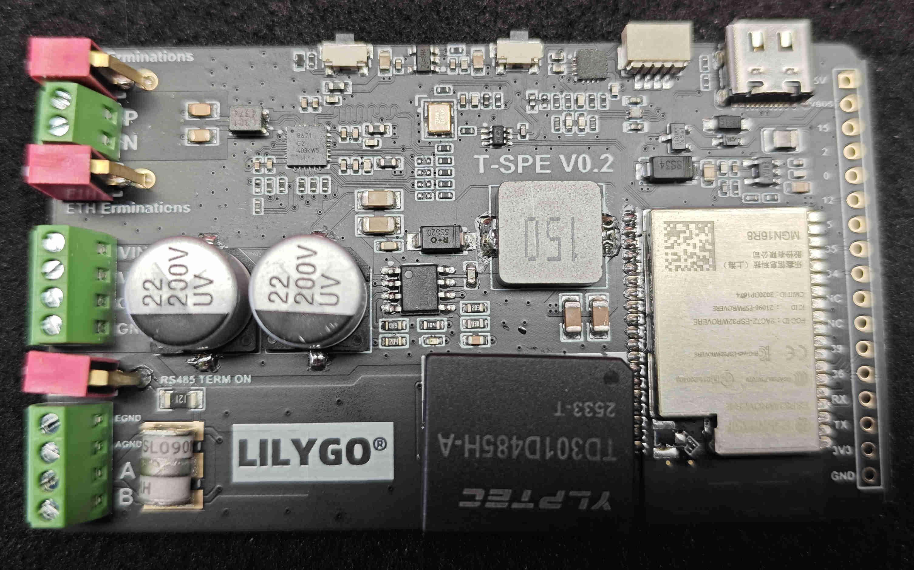
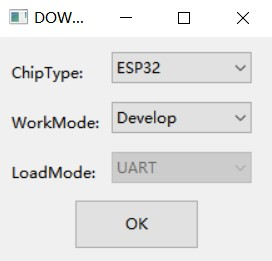
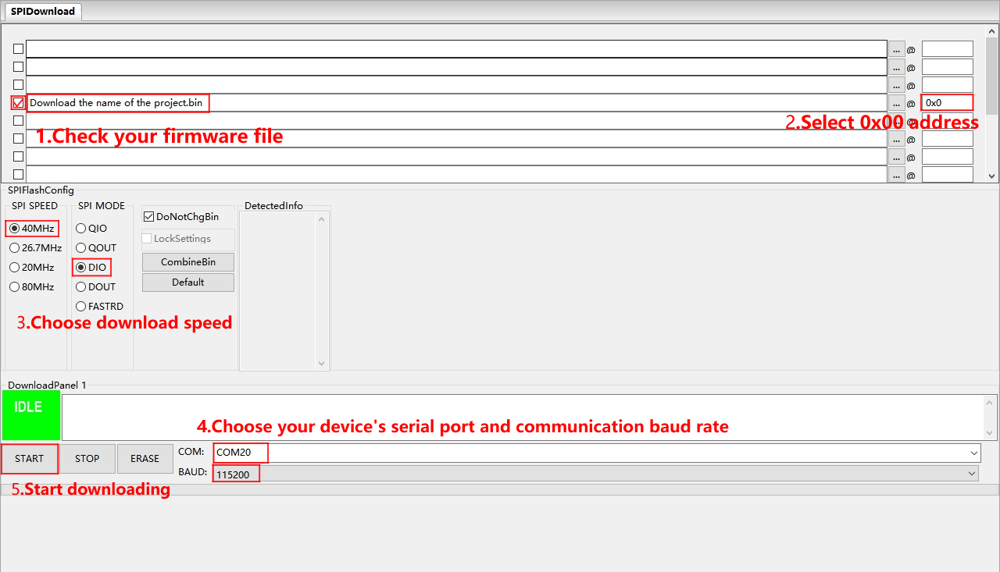

<!--
 * @Description: None
 * @Author: LILYGO_L
 * @Date: 2026-03-13 15:16:40
 * @LastEditTime: 2026-03-13 16:42:55
 * @License: GPL 3.0
-->
<h1 align = "center">T-Spe</h1>

## **[English](./README.md) | 中文**

## 版本迭代:
| Version                               | Update date                       |Update description|
| :-------------------------------: | :-------------------------------: |:--------------: |
| T-Spe_V1.0                      | 2026-03-13                    |   初始版本      |

## 购买链接

| Product                     | SOC           |  FLASH  |  PSRAM   | Link                   |
| :------------------------: | :-----------: |:-------: | :---------: | :------------------: |
| T-Spe_V1.0   | NULL |   NULL   | NULL |  [NULL]()   |

## 目录
- [描述](#描述)
- [预览](#预览)
- [模块](#模块)
- [软件部署](#软件部署)
- [引脚总览](#引脚总览)
- [常见问题](#常见问题)
- [项目](#项目)

## 描述

T-Spe 是一款专为工业多网络通信设计的紧凑型控制器板。它以乐鑫 **ESP32** 为核心，同时板载 **Microchip LAN8671 10BASE-T1S 以太网 PHY** 和 **RS485 收发器**，将新兴的单对线以太网技术与经典的工业总线相结合。凭借 5–75V 超宽电压输入及无缝电源切换电路，T-Spe 可稳定部署在工厂自动化、车载系统、智能电网等严苛环境中，作为边缘计算节点或协议转换网关。

## 预览
### 预览版测试图片

    

---

### 实物图

## 模块

### 1. 核心处理器模块

* 芯片：ESP32-WROVER-E
* FLASH：16M
* PSRAM：8M
* 相关资料：
    >[Espressif](https://documentation.espressif.com/esp32-wrover-e_esp32-wrover-ie_datasheet_en.html)

### 2. 以太网

* 芯片：LAN8671
* 通信协议：RMII
* 相关资料：
    >[LAN8671](./docs/LAN8671C2T-E-U3B.pdf)  

### 3. RS485

* 模组：TD301D485H-A
* 通信协议：UART
* 相关资料：
    >[TD301D485H-A](./docs/TD301D485H-A.pdf)
* 依赖库：
    >[cpp_bus_driver](https://github.com/Llgok/cpp_bus_driver)

### 4. 降压芯片

* 芯片：SY8513
* 其他说明：支持输入电压 5-75V
* 相关资料：
    >[SY8513](./docs/DS_SY8513.pdf)

## 软件部署

### 示例支持

| example | `[vscode][esp-idf-v5.5.3]` | description | picture |
| ------  | ------ | ------ | ------ | 
| [general_test](./main/examples/general_test) |  
![alt text][supported] |出厂示例 | |
| [iperf_ethernet](./main/examples/iperf_ethernet) |  
![alt text][supported] | | |
| [rs485](./main/examples/rs485) |  
![alt text][supported] | | |
| [wifi](./main/examples/wifi) |  
![alt text][supported] | | |
| [wifi_http_download_file](./main/examples/wifi_http_download_file) |  
![alt text][supported] | | |

[supported]: https://img.shields.io/badge/-supported-green "example"

| firmware | description | picture |
| ------  | ------  | ------ |
| [general_test](./firmware/[T-Spe][general_test]) | 出厂程序 |  |

### ESP-IDF Visual Studio Code
1. 安装 [Visual Studio Code](https://code.visualstudio.com/Download) ，根据你的系统类型选择安装。

2. 打开 VisualStudioCode 软件侧边栏的“扩展”（或者使用<kbd>Ctrl</kbd>+<kbd>Shift</kbd>+<kbd>X</kbd>打开扩展），搜索“ESP-IDF”扩展并下载。

3. 在安装扩展的期间，使用git命令克隆仓库

        git clone --recursive https://github.com/Xinyuan-LilyGO/T-Spe.git

    克隆时候需要同时加上“--recursive”，如果克隆时候未加上那么之后使用的时候需要初始化一下子模块

        git submodule update --init --recursive

4. 下载安装 [ESP-IDF v5.5.3](https://dl.espressif.cn/dl/esp-idf/?idf=4.4)，记录一下安装路径，打开之前安装好的“ESP-IDF”扩展打开“配置 ESP-IDF 扩展”，选择“USE EXISTING SETUP”菜单，选择“Search ESP-IDF in system”栏，正确配置之前记录的安装路径：
   - **ESP-IDF directory (IDF_PATH):** `你的安装路径xxx\Espressif\frameworks\esp-idf-v5.5.3`  
   - **ESP-IDF Tools directory (IDF_TOOLS_PATH):** `你的安装路径xxx\Espressif`  
    点击右下角的“install”进行框架安装。

5. 点击 Visual Studio Code 底部菜单栏的 ESP-IDF 扩展菜单“SDK 配置编辑器”，在搜索栏里搜索“Select the example to build”字段，选择你所需要编译的项目，点击保存。

6. 点击 Visual Studio Code 底部菜单栏的“设置乐鑫设备目标”，选择**ESP32**，点击底部菜单栏的“构建项目”，等待构建完成后点击底部菜单栏的“选择要使用的端口”，之后点击底部菜单栏的“烧录项目”进行烧录程序。

### firmware烧录
1. 打开项目文件“tools”找到ESP32烧录工具，打开。

2. 选择正确的烧录芯片以及烧录方式点击“OK”，如图所示根据步骤1->2->3->4->5即可烧录程序，如果烧录不成功，请按住“BOOT-0”键再下载烧录。

3. 烧录文件在项目文件根目录“[firmware](./firmware/)”文件下，里面有对firmware文件版本的说明，选择合适的版本下载即可。

    
    

## 引脚总览

引脚定义请参考配置文件：
 

[t_spe_config.h](https://github.com/Xinyuan-LilyGO/lilygo_device_driver/blob/main/src/device/t_spe/t_spe_config.h)  

## 常见问题

* Q. 看了以上教程我还是不会搭建编程环境怎么办？
* A. 如果看了以上教程还不懂如何搭建环境的可以参考[LilyGo-Document](https://github.com/Xinyuan-LilyGO/LilyGo-Document)文档说明来搭建。

 

* Q. 为什么我的板子一直烧录失败呢？
* A. 请按住“BOOT”按键重新下载程序。

 

## 项目
* [T-Spe_V1.0_202603131624](./project/T-Spe_V1.0_202603131624.pdf)
